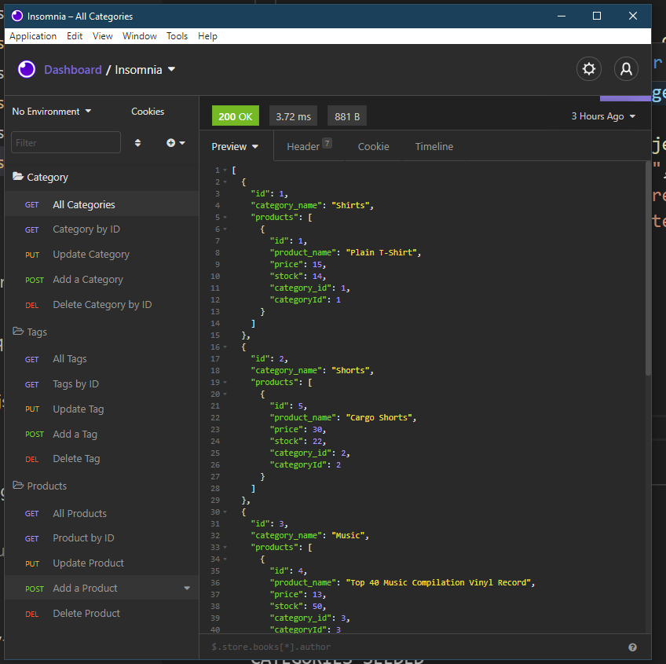

# e-commerce backend

  

  

          
### Description 

The E-Commerce Backend is a mysql database and application backend for an e-commerce site. This application has been built using MySQL2, Express, Sequelize and dotenv. Insomnia Core is utilized to demonstrate the functionalities of this application.

Ecommerce runs on a mySQL database that is made accessible via a command line CMS. The application allows you to many products and linking them to categories and tags 

### Table of Contents

* [Usage Guide](#Usage-Guide)
* [Install Instructions](#Installation)
* [Technologies Used](#Technologies-Used)
* [Contributions](#Contributions)
* [Tests](#Tests)
* [Questions](#Questions)

## Usage Guide 

Insomina is used to test the functionality.

Watch [this](https://drive.google.com/file/d/1xRfVmBduITnUHBzV3eBGXjTN8yS7J8DD/view) video to learn more 

## Installation 

You will need to create an .env file and populate..

`DB_USER= ''`

`DB_PASSWORD= ''`

`DB_NAME='employee_tracker_db'`

Create the Database using schema.sql

`CREATE DATABASE ecommerce_db;`

Install packages

`NPM install` 

Run the application

`Node index.js`

## Technologies Used 

Node, Express, Sequelize, Insomnia

## Contributions 

This is currently my own work. Please feel free to submit your contributions on GITHUB with credits given

## Tests 

Future testing planned using Jest testing framework

## Questions 

If you have any questions or want to keep up with my latest projects, please follow me on [Github](http://www.github.com/operationBrass) or contact me via [Email](mr.brn.lewis@outlook.com). 
